### Part 1 - My Project
For my final project, I chose to create a [personal website]((https://abbygriffin4.github.io). I’m hoping to use it as a supplementary material to apply to jobs in the future and as a way to keep my coding and Git skills up to date!

### Part 2 - How I did it
I ran into several errors while trying to create this website. I began by trying to download aesthetically pleasing/seemingly simple Jekyll themes from various sites, but many of them required something called RubyGem to manually install the theme. I attempted to do manual install in a variety of different ways but ultimately, my computer was not able to access the Ruby library. So, my process looked a little something like this:    

#### Create Github Repo with just your user   
1. Go to [Github](github.com) and create a repository `yourusername.github.io`.     

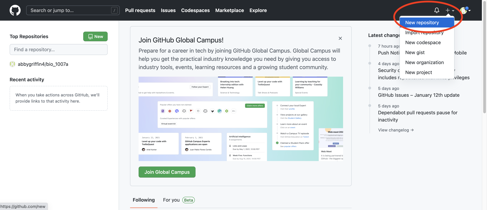{width=50%}

2. Use Terminal to clone this repository to your computer `git clone https://github.com/yourusername/yourusername.github.io`       

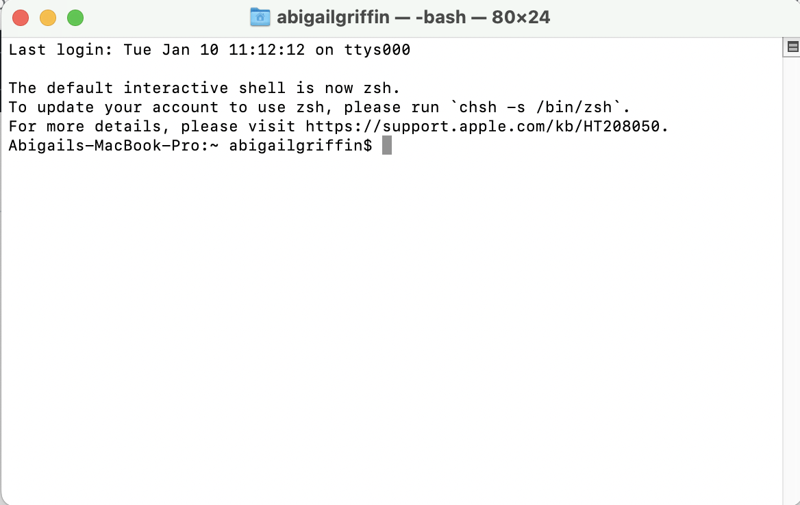{width=50%}
 
* If this doesn’t work, just create a new project in RStudio and paste the `HTTPS` from `<> Code`, just as we did to create our BIOL1007A repo’s.       
* Tip: If you do this, make sure your project name is the exact same as your GitHub project name (so I had a folder on my computer named `abbygriffin4.github.io`, the same as the GitHub repo I had just created)

#### Download Jekyll Theme   
1. Find a [Jekyll theme](jekyllthemes.io) that does not require RubyGem.    

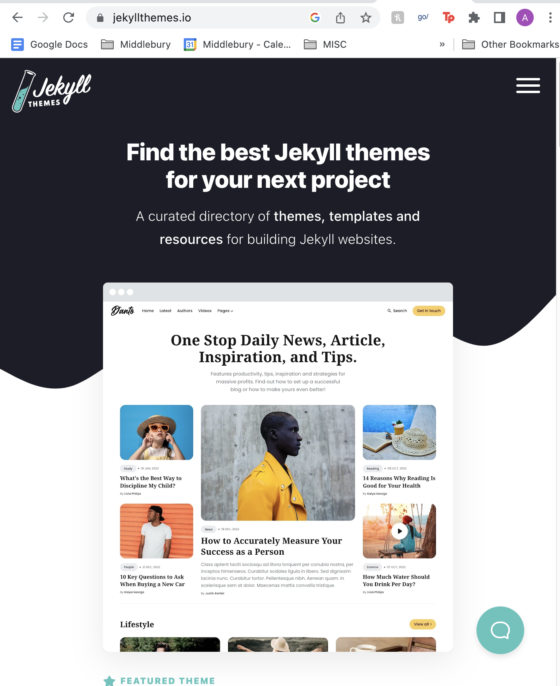{width=50%}

2. Navigate to the theme’s Repo, click `<> Code` -> Download ZIP    
3. Unzip the file, copy the contents (hold Command on your keyboard and drag down from the top file to select all) and paste into your `yourusername.github.io` folder on your Desktop.    
4. `git status`->`git add`->`git commit -am ‘upload theme`->`git push` to upload your theme    
* Troubleshooting tip: when I first attempted to do this, I was in the wrong working directory. To fix this, type `ls` to see where you are. I was in my users folder, the parent folder of my Desktop. I then typed `cd Desktop` and `cd abbygriffin4.github.io` to get into the working directory of my project.        
  
  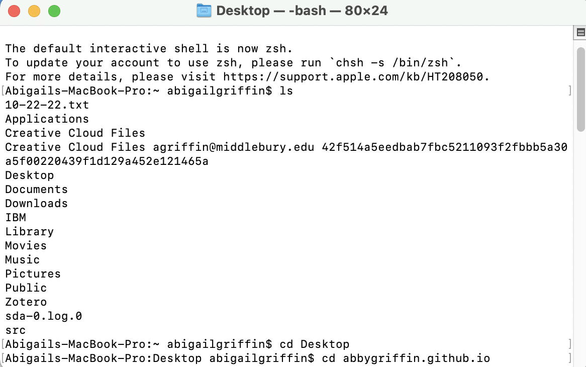{width=50%}
 
* If you’re in the wrong folder and need to go back, type `cd ..`. Incrementally, you can go back and forth to get to the correct folder.   

* Visit `yourusername.github.io` to see your theme and ensure everything is working properly.      
  + *I downloaded the `Beautiful` theme from Jekyll and found it relatively simple to follow.*      

#### Edit default files
1. Read through the README to see how the author has set up each site and what can be modified.   

  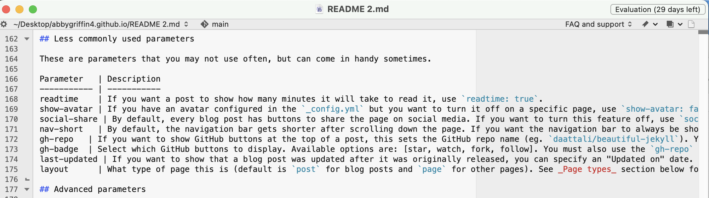{width=50%}

2. The way Jekyll webpages work is that each file is a different page or component of the website. By modifying the existing HTML files, you change how the website appears.   

  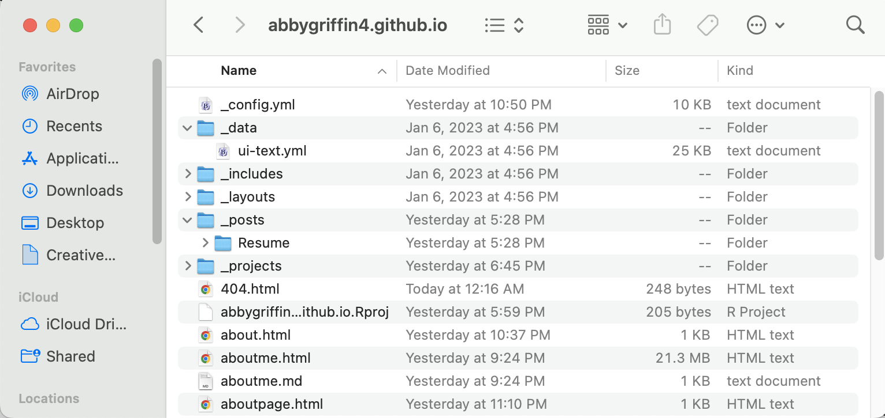{width=50%}

3. A good place to start modifying is the `configure.yml` file. For me, this file set up the main components of the theme of my page like the font, colors, and navigation tabs you see at the top. It also allows you to input information for the “Contact” options on the website.    
* I changed the avatar so my profile would stay at the top of each page
* Similar to RStudio, there are color codes for specific colors. Colors must be in CSS format, so it’s something like “C2E8F0” for blue instead of “lightcyan”. Definitely a drawback.    
  
    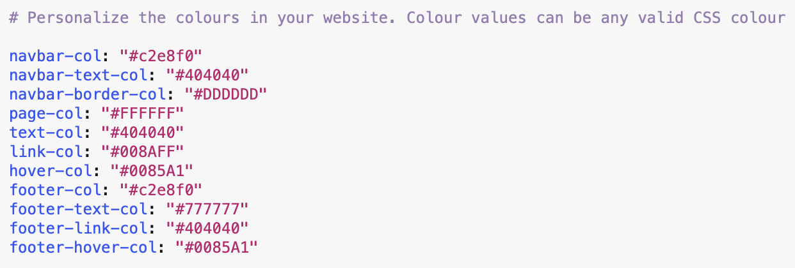{width=50%}
    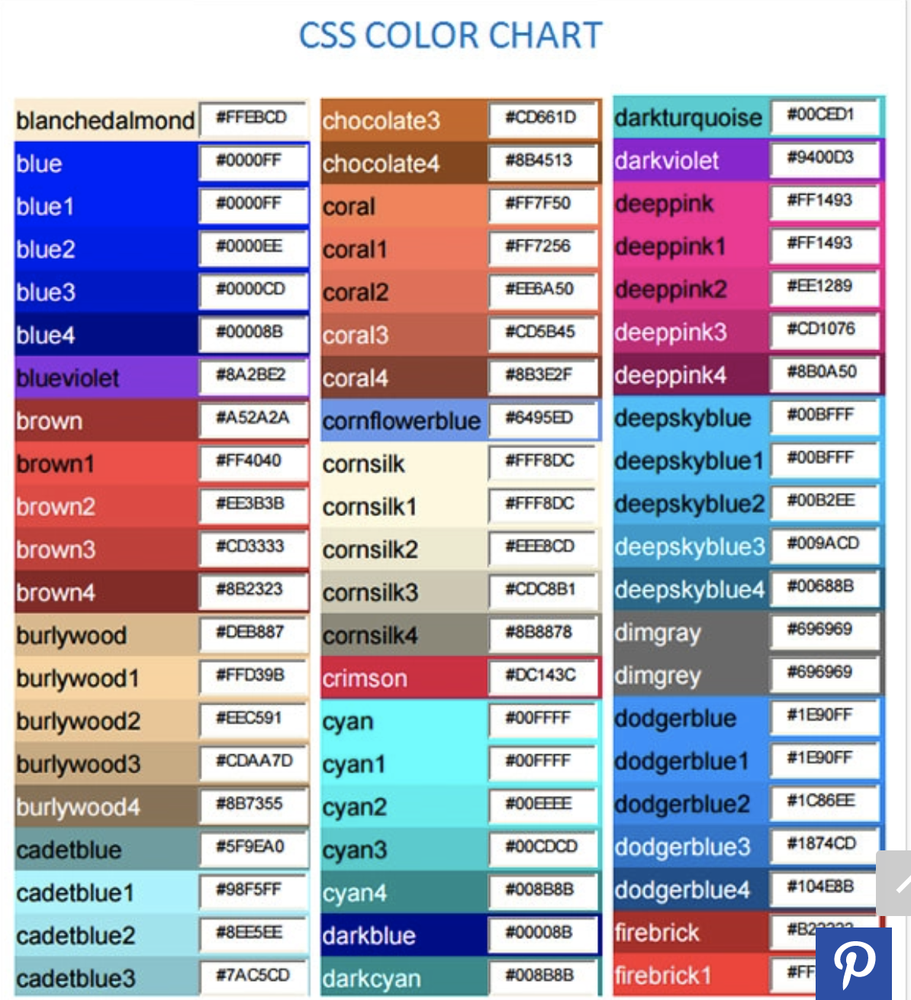{width=50%}
4. My page was set up like a blog site and I wanted to make it more relevant to my academic experiences.
  + I looked at the code of some other Jekyll sites which were set up the way I wanted my site to look, but ultimately this wasn’t really helpful as every theme has very specific parameters. The most helpful tool was, again, the README file.
5. Almost all of the files in my repository were HTML files, which means I couldn’t work with them in R or RStudio. I had to download an HTML editor, BBText, in order to edit them and keep them in this format.
  + However, this also required me to learn the basics of HTML. 
  + In HTML, it was difficult to foresee what any changes would be without the Knit function. BBEdit did have a Preview function, but it didn’t connect to the Jekyll theme on Git. Instead, the page just appeared as a standard HTML file. **I ended up downloading Whisk which is a Live HTML editor—it puts your code next to your output and changes as you type.**   
  
    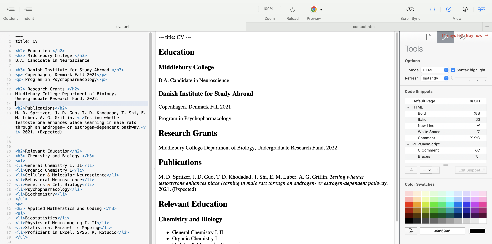{width=50%}
6. I ended up adding additional navigation tabs like “About, CV, Contact” as well as a Dropdown menu with links to my lab page and LinkedIn. I did this by editing my `config.yml` file and linking it to the relevant HTML file.   

  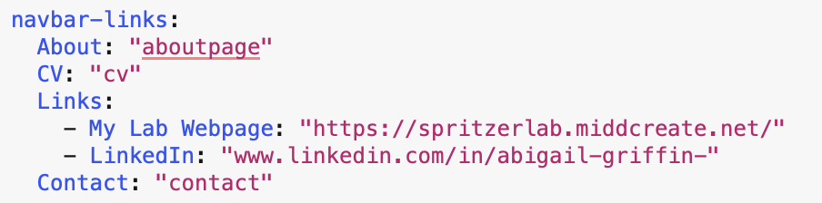{width=50%}
  {width=50%}

7. One issue I had with the `Beautiful` theme was that the original “About Me” page was a Markdown file. This resulted in this link looking like a Markdown file and not taking the theme of the rest of the website. Knitting to HTML should have copied everything from the Markdown document into HTML format, but it didn’t. When I tried to manually edit the text and image links in the BBText HTML editor, the file was too large and would stop responding. So, I decided to just make a new HTML file. I ended up creating a new HTML file which fixed this issue. However, I’m still having trouble getting images to show up on this page - if you have any suggestions, please let me know!   

  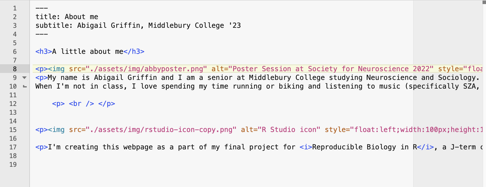{width=50%}
    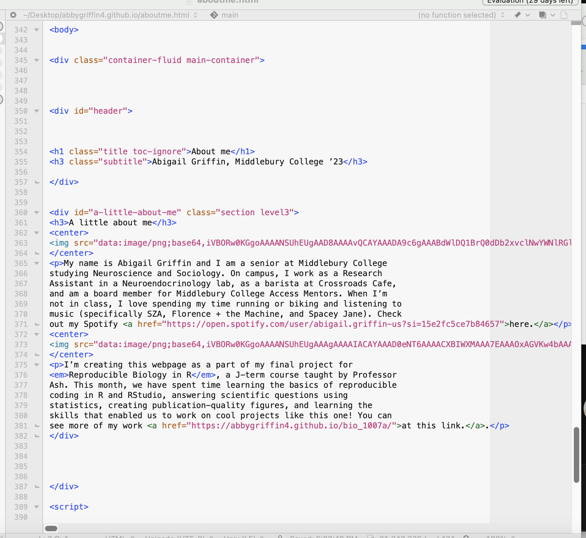{width=50%}

#### Other roadblocks/tips/general complaints
* HTML
  + Make sure to add paragraph tags `
 
`
  + If you need to add space between paragraphs: `
   
`
  + For headers, the format is `<h3> text </h3>`. Header styles range from `<h1>` to `<h6>` where `h1` is a larger header than `h2 > h3 > h4 …` and so on.
  + Creating list using `<ul> <li>bulleted text 1 </li> <li>bulleted text 2</li></ul>`
* For this theme, each new HTML page you create must have this at the top or else it will be a plain HTML file:   
`- - - `    
`title: CV`   
`- - -`   
* Change side which image appears on (float) and size (width / height) `
`
